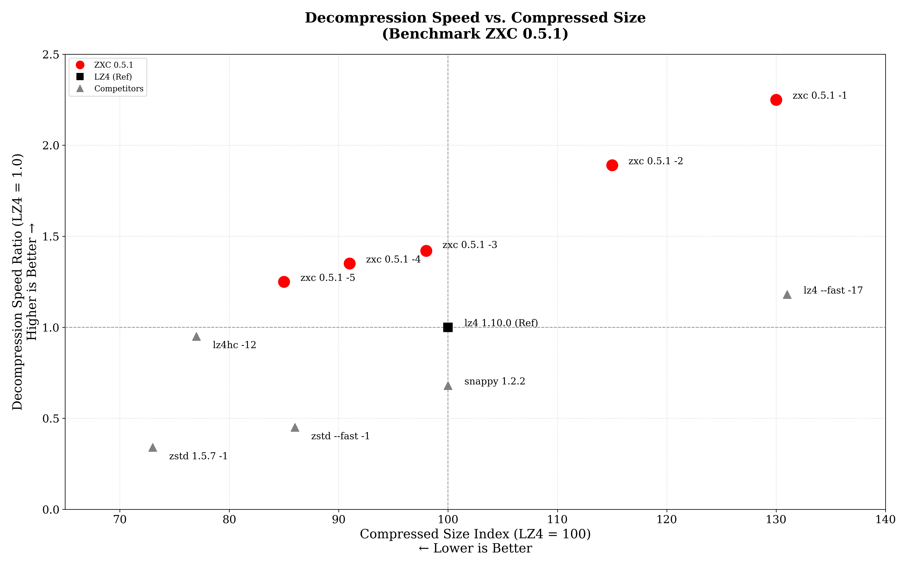

# ZXC: High-Performance Asymmetric Lossless Compression

[](https://github.com/hellobertrand/zxc/actions/workflows/build.yml)
[](https://github.com/hellobertrand/zxc/actions/workflows/quality.yml)
[](https://github.com/hellobertrand/zxc/actions/workflows/fuzzing.yml)
[](https://github.com/hellobertrand/zxc/actions/workflows/benchmark.yml)

[](LICENSE)


**ZXC** is a high-performance, lossless, asymmetric compression library optimized for **Content Delivery** and **Embedded Systems** (Game Assets, Firmware, App Bundles).
It is designed to be *"Write Once, Read Many."*. Unlike codecs like LZ4, ZXC trades compression speed (build-time) for **maximum decompression throughput** (run-time).

> **Key Result:** ZXC outperforms LZ4 decompression by **>+40% on Apple Silicon**, **>+20% on Cloud ARM (Google Axion)**, and **>+5% on x86_64** with **better compression ratios**, accepting **slower compression speed** as the strategic trade-off.

> **Verified:** ZXC has been officially merged into the **[lzbench master branch](https://github.com/inikep/lzbench)**. You can now verify these results independently using the industry-standard benchmark suite.


## ZXC Design Philosophy

Traditional codecs often force a trade-off between **symmetric speed** (LZ4) and **archival density** (Zstd).

**ZXC focuses on Asymmetric Efficiency.**

Designed for the "Write-Once, Read-Many" reality of software distribution, ZXC utilizes a computationally intensive encoder to generate a bitstream specifically structured to **maximize decompression throughput**.
By performing heavy analysis upfront, the encoder produces a layout optimized for the instruction pipelining and branch prediction capabilities of modern CPUs, particularly ARMv8, effectively offloading complexity from the decoder to the encoder.

*   **Build Time:** You generally compress only once (on CI/CD).
*   **Run Time:** You decompress millions of times (on every user's device). **ZXC respects this asymmetry.**

[👉 **Read the Technical Whitepaper**](./WHITEPAPER.md)


## Benchmarks

To ensure consistent performance, benchmarks are automatically executed on every commit via GitHub Actions.
We monitor metrics on both **x86_64** (Linux) and **ARM64** (Apple Silicon M1/M2) runners to track compression speed, decompression speed, and ratios.

*(See the [latest benchmark logs](https://github.com/hellobertrand/zxc/actions/workflows/benchmark.yml))*


### 1. Mobile & Client: Apple Silicon (M2)
*Scenario: Game Assets loading, App startup.*

| Target | ZXC vs Competitor | Decompression Speed | Ratio | Verdict |
| :--- | :--- | :--- | :--- | :--- |
| **1. Max Speed** | **ZXC -1** vs *LZ4 --fast* | **10,821 MB/s** vs 5,646 MB/s **1.92x Faster** | **61.8** vs 62.2 **Equivalent** (-0.5%) | **ZXC** leads in raw throughput. |
| **2. Standard** | **ZXC -3** vs *LZ4 Default* | **6,846 MB/s** vs 4,806 MB/s **1.42x Faster** | **46.5** vs 47.6 **Smaller** (-2.4%) | **ZXC** outperforms LZ4 in read speed and ratio. |
| **3. High Density** | **ZXC -5** vs *Zstd --fast 1* | **5,986 MB/s** vs 2,160 MB/s **2.77x Faster** | **40.7** vs 41.0 **Equivalent** (-0.9%) | **ZXC** outperforms Zstd in decoding speed. |

### 2. Cloud Server: Google Axion (ARM Neoverse V2)
*Scenario: High-throughput Microservices, ARM Cloud Instances.*

| Target | ZXC vs Competitor | Decompression Speed | Ratio | Verdict |
| :--- | :--- | :--- | :--- | :--- |
| **1. Max Speed** | **ZXC -1** vs *LZ4 --fast* | **8,043 MB/s** vs 4,885 MB/s **1.65x Faster** | **61.8** vs 62.2 **Equivalent** (-0.5%) | **ZXC** leads in raw throughput. |
| **2. Standard** | **ZXC -3** vs *LZ4 Default* | **5,151 MB/s** vs 4,186 MB/s **1.23x Faster** | **46.5** vs 47.6 **Smaller** (-2.4%) | **ZXC** outperforms LZ4 in read speed and ratio. |
| **3. High Density** | **ZXC -5** vs *Zstd --fast 1* | **4,454 MB/s** vs 1,758 MB/s **2.53x Faster** | **40.7** vs 41.0 **Equivalent** (-0.9%) | **ZXC** outperforms Zstd in decoding speed. |

### 3. Build Server: x86_64 (AMD EPYC 7763)
*Scenario: CI/CD Pipelines compatibility.*

| Target | ZXC vs Competitor | Decompression Speed | Ratio | Verdict |
| :--- | :--- | :--- | :--- | :--- |
| **1. Max Speed** | **ZXC -1** vs *LZ4 --fast* | **5,631 MB/s** vs 4,104 MB/s **1.37x Faster** | **61.8** vs 62.2 **Equivalent** (-0.5%) | **ZXC** achieves higher throughput. |
| **2. Standard** | **ZXC -3** vs *LZ4 Default* | **3,854 MB/s** vs 3,537 MB/s **1.09x Faster** | **46.5** vs 47.6 **Smaller** (-2.4%) | ZXC offers improved speed and ratio. |
| **3. High Density** | **ZXC -5** vs *Zstd --fast 1* | **3,481 MB/s** vs 1,571 MB/s **2.22x Faster** | **40.7** vs 41.0 **Equivalent** (-0.9%) | **ZXC** provides faster decoding. |


*(Benchmark Graph ARM64 : Decompression Throughput & Storage Ratio (Normalized to LZ4))*



### Benchmark ARM64 (Apple Silicon)

Benchmarks were conducted using lzbench 2.2.1 (from @inikep), compiled with Clang 17.0.0 using *MOREFLAGS="-march=native"* on macOS Sequoia 15.7.2 (Build 24G325). The reference hardware is an Apple M2 processor (ARM64). All performance metrics reflect single-threaded execution on the standard Silesia Corpus.

| Compressor name         | Compression| Decompress.| Compr. size | Ratio | Filename |
| ---------------         | -----------| -----------| ----------- | ----- | -------- |
| memcpy                  | 52806 MB/s | 52762 MB/s |   211938580 |100.00 | 12 files|
| **zxc 0.5.1 -1**            |   608 MB/s | **10821 MB/s** |   131005109 | **61.81** | 12 files|
| **zxc 0.5.1 -2**            |   416 MB/s |  **9106 MB/s** |   116029050 | **54.75** | 12 files|
| **zxc 0.5.1 -3**            |   150 MB/s |  **6846 MB/s** |    98475231 | **46.46** | 12 files|
| **zxc 0.5.1 -4**            |   101 MB/s |  **6496 MB/s** |    92030470 | **43.42** | 12 files|
| **zxc 0.5.1 -5**            |  57.4 MB/s |  **5986 MB/s** |    86180735 | **40.66** | 12 files|
| lz4 1.10.0              |   811 MB/s |  4806 MB/s |   100880147 | 47.60 | 12 files|
| lz4 1.10.0 --fast -17   |  1345 MB/s |  5646 MB/s |   131723524 | 62.15 | 12 files|
| lz4hc 1.10.0 -12        |  13.9 MB/s |  4543 MB/s |    77262399 | 36.46 | 12 files|
| zstd 1.5.7 -1           |   642 MB/s |  1622 MB/s |    73229468 | 34.55 | 12 files|
| zstd 1.5.7 --fast --1   |   721 MB/s |  2160 MB/s |    86932028 | 41.02 | 12 files|
| brotli 1.2.0 -0         |   535 MB/s |   416 MB/s |    78306095 | 36.95 | 12 files|
| snappy 1.2.2            |   877 MB/s |  3264 MB/s |   101352257 | 47.82 | 12 files|

### Benchmark ARM64 (Google Axion)

Benchmarks were conducted using lzbench 2.2.1 (from @inikep), compiled with GCC 12.2.0 using *MOREFLAGS="-march=native"* on Linux 64-bits Debian GNU/Linux 12 (bookworm). The reference hardware is a Google Neoverse-V2 processor (ARM64). All performance metrics reflect single-threaded execution on the standard Silesia Corpus.

| Compressor name         | Compression| Decompress.| Compr. size | Ratio | Filename |
| ---------------         | -----------| -----------| ----------- | ----- | -------- |
| memcpy                  | 24629 MB/s | 24733 MB/s |   211938580 |100.00 | 12 files|
| **zxc 0.5.1 -1**            |   559 MB/s | **8043 MB/s** |   131005109 | **61.81** | 12 files|
| **zxc 0.5.1 -2**            |   379 MB/s | **6890 MB/s** |   116029050 | **54.75** | 12 files|
| **zxc 0.5.1 -3**            |   148 MB/s | **5151 MB/s** |    98475231 | **46.46** | 12 files|
| **zxc 0.5.1 -4**            |  96.7 MB/s | **4910 MB/s** |    92030470 | **43.42** | 12 files|
| **zxc 0.5.1 -5**            |  53.1 MB/s | **4454 MB/s** |    86180735 | **40.66** | 12 files|
| lz4 1.10.0              |   745 MB/s |  4186 MB/s |   100880147 | 47.60 | 12 files|
| lz4 1.10.0 --fast -17   |  1292 MB/s |  4885 MB/s |   131723524 | 62.15 | 12 files|
| lz4hc 1.10.0 -12        |  12.3 MB/s |  3809 MB/s |    77262399 | 36.46 | 12 files|
| zstd 1.5.7 -1           |   523 MB/s |  1352 MB/s |    73229468 | 34.55 | 12 files|
| zstd 1.5.7 --fast --1   |   607 MB/s |  1758 MB/s |    86932028 | 41.02 | 12 files|
| brotli 1.2.0 -0         |   426 MB/s |   383 MB/s |    78306095 | 36.95 | 12 files|
| snappy 1.2.2            |   749 MB/s |  1834 MB/s |   101352257 | 47.82 | 12 files|


### Benchmark x86_64

Benchmarks were conducted using lzbench 2.2.1 (from @inikep), compiled with GCC 13.3.0 using *MOREFLAGS="-march=native"* on Linux 64-bits Ubuntu 24.04. The reference hardware is an AMD EPYC 7763 processor (x86_64). All performance metrics reflect single-threaded execution on the standard Silesia Corpus.

| Compressor name         | Compression| Decompress.| Compr. size | Ratio | Filename |
| ---------------         | -----------| -----------| ----------- | ----- | -------- |
| memcpy                  | 19798 MB/s | 19472 MB/s |   211938580 |100.00 | 12 files|
| **zxc 0.5.1 -1**            |   463 MB/s |  **5631 MB/s** |   131005109 | **61.81** | 12 files|
| **zxc 0.5.1 -2**            |   313 MB/s |  **4823 MB/s** |   116029050 | **54.75** | 12 files|
| **zxc 0.5.1 -3**            |   109 MB/s |  **3854 MB/s** |    98475231 | **46.46** | 12 files|
| **zxc 0.5.1 -4**            |  73.0 MB/s |  **3697 MB/s** |    92030470 | **43.42** | 12 files|
| **zxc 0.5.1 -5**            |  41.9 MB/s |  **3481 MB/s** |    86180735 | **40.66** | 12 files|
| lz4 1.10.0              |   593 MB/s |  3537 MB/s |   100880147 | 47.60 | 12 files|
| lz4 1.10.0 --fast -17   |  1032 MB/s |  4104 MB/s |   131723524 | 62.15 | 12 files|
| lz4hc 1.10.0 -12        |  11.3 MB/s |  3468 MB/s |    77262399 | 36.46 | 12 files|
| zstd 1.5.7 -1           |   412 MB/s |  1196 MB/s |    73229468 | 34.55 | 12 files|
| zstd 1.5.7 --fast --1   |   452 MB/s |  1571 MB/s |    86932028 | 41.02 | 12 files|
| brotli 1.2.0 -0         |   355 MB/s |   286 MB/s |    78306095 | 36.95 | 12 files|
| snappy 1.2.2            |   611 MB/s |  1588 MB/s |   101464727 | 47.87 | 12 files|


---

## Installation

### Option 1: Download Release (GitHub)

1.  Go to the [Releases page](https://github.com/hellobertrand/zxc/releases).
2.  Download the binary matching your architecture:
    
    **macOS:**
    *   `zxc-macos-arm64` (Universal: NEON32/64 optimizations included).
    
    **Linux:**
    *   `zxc-linux-aarch64` (Universal: NEON32/64 optimizations included).
    *   `zxc-linux-x86_64` (Universal: Includes runtime dispatch for AVX2/AVX512).
    
    **Windows:**
    *   `zxc-windows-x64.exe` (Universal: Includes runtime dispatch for AVX2/AVX512).
    
    **Windows:**


3.  Make the binary executable (Unix-like systems):
    ```bash
    chmod +x zxc-*
    mv zxc-* zxc
    ```

### Option 2: Building from Source

**Requirements:** CMake (3.14+), C11 Compiler (Clang/GCC/MSVC).

```bash
git clone https://github.com/hellobertrand/zxc.git
cd zxc
mkdir build && cd build
cmake .. -DCMAKE_BUILD_TYPE=Release
make -j$(nproc)
# Binary usage:
./zxc --help
```

#### CMake Options

| Option | Default | Description |
|--------|---------|-------------|
| `ZXC_NATIVE_ARCH` | ON | Enable `-march=native` for maximum performance |
| `ZXC_ENABLE_LTO` | ON | Enable Link-Time Optimization (LTO) |
| `ZXC_PGO_MODE` | OFF | Profile-Guided Optimization mode (`OFF`, `GENERATE`, `USE`) |
| `ZXC_BUILD_CLI` | ON | Build command-line interface |
| `ZXC_BUILD_TESTS` | ON | Build unit tests |

```bash
# Portable build (without -march=native)
cmake -DZXC_NATIVE_ARCH=OFF ..

# Library only (no CLI, no tests)
cmake -DZXC_BUILD_CLI=OFF -DZXC_BUILD_TESTS=OFF ..
```

---

## Compression Levels

*   **Level 1, 2 (Fast):** Optimized for real-time assets (Gaming, UI). ~40% faster loading than LZ4 with comparable compression (Level 3).
*   **Level 3, 4 (Balanced):** A strong middle-ground offering efficient compression speed and a ratio superior to LZ4.
*   **Level 5 (Compact):** The best choice for Embedded, Firmware, or Archival. Better compression than LZ4 and significantly faster decoding than Zstd.

---

## Usage

### 1. CLI

The CLI is perfect for benchmarking or manually compressing assets.

```bash
# Basic Compression (Level 3 is default)
zxc -z input_file output_file

# High Compression (Level 5)
zxc -z -5 input_file output_file

# -z for compression can be omitted
zxc input_file output_file

# as well as output file; it will be automatically assigned to input_file.xc
zxc input_file

# Decompression
zxc -d compressed_file output_file

# Benchmark Mode (Testing speed on your machine)
zxc -b input_file
```
### 2. API

ZXC provides a fully **thread-safe (stateless)** and **binding-friendly API**, utilizing caller-allocated buffers with explicit bounds. Integration is straightforward: simply include `zxc.h` and link against `lzxc_lib`.

#### Single-Threaded API (Memory Buffers)
Ideal for small assets or simple integrations. Ready for highly concurrent environments (Go routines, Node.js workers, Python threads).

```c
#include "zxc.h"
#include <stdio.h>
#include <stdlib.h>
#include <string.h>

int main(void) {
    // Original data to compress
    const char* original = "Hello, ZXC! This is a sample text for compression.";
    size_t original_size = strlen(original) + 1;  // Include null terminator

    // Step 1: Calculate maximum compressed size
    size_t max_compressed_size = zxc_compress_bound(original_size);

    // Step 2: Allocate buffers
    void* compressed = malloc(max_compressed_size);
    void* decompressed = malloc(original_size);

    if (!compressed || !decompressed) {
        fprintf(stderr, "Memory allocation failed\n");
        free(compressed);
        free(decompressed);
        return 1;
    }

    // Step 3: Compress data (Level 3, checksum enabled)
    size_t compressed_size = zxc_compress(
        original,           // Source buffer
        original_size,      // Source size
        compressed,         // Destination buffer
        max_compressed_size,// Destination capacity
        ZXC_LEVEL_DEFAULT,  // Compression level
        1                   // Enable checksum
    );

    if (compressed_size == 0) {
        fprintf(stderr, "Compression failed\n");
        free(compressed);
        free(decompressed);
        return 1;
    }

    printf("Original size: %zu bytes\n", original_size);
    printf("Compressed size: %zu bytes (%.1f%% ratio)\n",
           compressed_size, 100.0 * compressed_size / original_size);

    // Step 4: Decompress data (checksum verification enabled)
    size_t decompressed_size = zxc_decompress(
        compressed,         // Source buffer
        compressed_size,    // Source size
        decompressed,       // Destination buffer
        original_size,      // Destination capacity
        1                   // Verify checksum
    );

    if (decompressed_size == 0) {
        fprintf(stderr, "Decompression failed\n");
        free(compressed);
        free(decompressed);
        return 1;
    }

    // Step 5: Verify integrity
    if (decompressed_size == original_size &&
        memcmp(original, decompressed, original_size) == 0) {
        printf("Success! Data integrity verified.\n");
        printf("Decompressed: %s\n", (char*)decompressed);
    } else {
        fprintf(stderr, "Data mismatch after decompression\n");
    }

    // Cleanup
    free(compressed);
    free(decompressed);
    return 0;
}
```

#### Multi-Threaded API (File Streams)
For large files, use the streaming API to process data in parallel chunks.
Here's a complete example demonstrating parallel file compression and decompression using the streaming API:

```c
#include "zxc.h"
#include <stdio.h>
#include <stdlib.h>

int main(int argc, char* argv[]) {
    if (argc != 4) {
        fprintf(stderr, "Usage: %s <input_file> <compressed_file> <output_file>\n", argv[0]);
        return 1;
    }

    const char* input_path = argv[1];
    const char* compressed_path = argv[2];
    const char* output_path = argv[3];

    // Step 1: Compress the input file using multi-threaded streaming
    printf("Compressing '%s' to '%s'...\n", input_path, compressed_path);

    FILE* f_in = fopen(input_path, "rb");
    if (!f_in) {
        fprintf(stderr, "Error: Cannot open input file '%s'\n", input_path);
        return 1;
    }

    FILE* f_out = fopen(compressed_path, "wb");
    if (!f_out) {
        fprintf(stderr, "Error: Cannot create output file '%s'\n", compressed_path);
        fclose(f_in);
        return 1;
    }

    // Compress with auto-detected threads (0), level 3, checksum enabled
    int64_t compressed_bytes = zxc_stream_compress(f_in, f_out, 0, ZXC_LEVEL_DEFAULT, 1);

    fclose(f_in);
    fclose(f_out);

    if (compressed_bytes < 0) {
        fprintf(stderr, "Compression failed\n");
        return 1;
    }

    printf("Compression complete: %lld bytes written\n", (long long)compressed_bytes);

    // Step 2: Decompress the file back using multi-threaded streaming
    printf("\nDecompressing '%s' to '%s'...\n", compressed_path, output_path);

    FILE* f_compressed = fopen(compressed_path, "rb");
    if (!f_compressed) {
        fprintf(stderr, "Error: Cannot open compressed file '%s'\n", compressed_path);
        return 1;
    }

    FILE* f_decompressed = fopen(output_path, "wb");
    if (!f_decompressed) {
        fprintf(stderr, "Error: Cannot create output file '%s'\n", output_path);
        fclose(f_compressed);
        return 1;
    }

    // Decompress with auto-detected threads (0), checksum verification enabled
    int64_t decompressed_bytes = zxc_stream_decompress(f_compressed, f_decompressed, 0, 1);

    fclose(f_compressed);
    fclose(f_decompressed);

    if (decompressed_bytes < 0) {
        fprintf(stderr, "Decompression failed\n");
        return 1;
    }

    printf("Decompression complete: %lld bytes written\n", (long long)decompressed_bytes);
    printf("\nSuccess! Verify the output file matches the original.\n");

    return 0;
}
```

**Compilation:**
```bash
gcc -o stream_example stream_example.c -I include -L build -lzxc_lib -lpthread -lm
```

**Usage:**
```bash
./stream_example large_file.bin compressed.xc decompressed.bin
```

This example demonstrates:
* Multi-threaded parallel processing (auto-detects CPU cores)
* Checksum validation for data integrity
* Error handling for file operations
* Progress tracking via return values

## Writing Your Own Streaming Driver / Binding to Other Languages
The streaming multi-threaded API in the previous example is just the default provided driver.
However, ZXC is written in a "sans-IO" style that separates compute from I/O and multitasking.
This allows you to write your own driver in any language of your choice, and use the native I/O
and multitasking capabilities of your language.
You will need only to include the extra public header `zxc_sans_io.h`, and implement
your own behavior based on `zxc_driver.c`.

### Community Bindings

| Language | Repository                           |
| -------- | ------------------------------------ |
| Go       | <https://github.com/meysam81/go-zxc> |

## Safety & Quality
* **Continuous Fuzzing**: Integrated with local ClusterFuzzLite suites.
* **Static Analysis**: Checked with CPPChecker & Clang Static Analyzer.
* **Dynamic Analysis**: Validated with Valgrind and ASan/UBSan in CI pipelines.
* **Safe API: Explicit** buffer capacity is required for all operations.


## License & Credits

**ZXC Codec** Copyright © 2025-2026, Bertrand Lebonnois.
Licensed under the **BSD 3-Clause License**. See LICENSE for details.

**Third-Party Components:**
- **rapidhash** by Nicolas De Carli (MIT) - Used for high-speed, platform-independent checksums.
