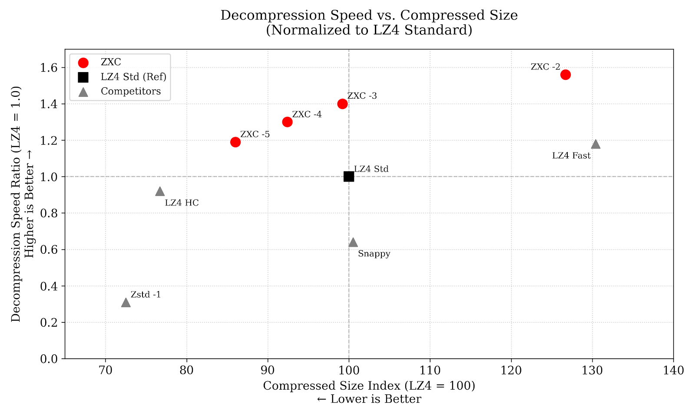

# ZXC: Asymmetric High-Performance Compression

[](https://github.com/hellobertrand/zxc/actions/workflows/build.yml)
[](https://github.com/hellobertrand/zxc/actions/workflows/quality.yml)
[](https://github.com/hellobertrand/zxc/actions/workflows/fuzzing.yml)
[](https://github.com/hellobertrand/zxc/actions/workflows/benchmark.yml)

[](LICENSE)


**ZXC** is an asymmetric high-performance lossless compression library optimized for **Content Delivery** and **Embedded Systems** (Game Assets, Firmware, App Bundles). 
It is designed to be *"Write Once, Read Many."*. Unlike symmetric codecs (LZ4), ZXC trades compression speed (build-time) for **maximum decompression throughput** (run-time).

> **Key Result:** ZXC outperforms LZ4 decompression by **+40% on Apple Silicon** and **+22% on Cloud ARM (Google Axion)**.  


## ZXC Design Philosophy

Traditional codecs often force a trade-off between **symmetric speed** (LZ4) and **archival density** (Zstd).

**ZXC focuses on Asymmetric Efficiency.**

Designed for the "Write-Once, Read-Many" reality of software distribution, ZXC utilizes a computationally intensive encoder to generate a bitstream specifically structured to **maximize decompression throughput**.
By performing heavy analysis upfront, the encoder produces a layout optimized for the instruction pipelining and branch prediction capabilities of modern CPUs, particularly ARMv8, effectively offloading complexity from the decoder to the encoder.

*   **Build Time:** You generally compress only once (on CI/CD).
*   **Run Time:** You decompress millions of times (on every user's device). **ZXC respects this asymmetry.**

[👉 **Read the Technical Whitepaper**](./WHITEPAPER.md)


## Benchmarks

To ensure consistent performance, benchmarks are automatically executed on every commit via GitHub Actions.
We monitor metrics on both **x86_64** (Linux) and **ARM64** (Apple Silicon M1/M2) runners to track compression speed, decompression speed, and ratios.

*(See the [latest benchmark logs](https://github.com/hellobertrand/zxc/actions/workflows/benchmark.yml))*


### 1. Mobile & Client: Apple Silicon (M2/M3)
*Scenario: Game Assets loading, App startup.*

| Codec | Decoding Speed | Ratio vs LZ4 | Verdict |
| :--- | :--- | :--- | :--- |
| **ZXC -3 (Standard)** | **6,365 MB/s** | **Smaller (-1.6%)** | **1.39x Faster than LZ4** |
| **ZXC -5 (Compact)** | **5,363 MB/s** | **Dense (-14.1%)** | **3.3x Faster than Zstd-1** |
| LZ4 1.10 | 4,571 MB/s | Reference | |

### 2. Cloud Server: Google Axion (ARM Neoverse V2)
*Scenario: High-throughput Microservices, ARM Cloud Instances.*

| Codec | Decoding Speed | Ratio vs LZ4 | Verdict |
| :--- | :--- | :--- | :--- |
| **ZXC -3 (Standard)** | **5,084 MB/s** | **Smaller (-1.6%)** | **1.22x Faster than LZ4** |
| LZ4 1.10 | 4,147 MB/s | Reference | |

### 3. Build Server: x86_64 (AMD EPYC)
*Scenario: CI/CD Pipelines compatibility.*

| Codec | Decoding Speed | Ratio vs LZ4 | Verdict |
| :--- | :--- | :--- | :--- |
| **ZXC -3 (Standard)** | **3,702 MB/s** | **Smaller (-1.6%)** | **Faster than LZ4 (+4%)** |
| LZ4 1.10 | 3,551 MB/s | Reference | Reference Speed |


*(Benchmark Graph ARM64 : Decompression Throughput & Storage Ratio (Normalized to LZ4))*



### Benchmark ARM64 (Apple Silicon)

Benchmarks were conducted using lzbench (from @inikep), compiled with Clang 17.0.0 on macOS Sequoia 15.7.2 (Build 24G325). The reference hardware is an Apple M2 processor (ARM64). All performance metrics reflect single-threaded execution on the standard Silesia Corpus.

| Compressor name         | Compression| Decompress.| Compr. size | Ratio | Filename |
| ---------------         | -----------| -----------| ----------- | ----- | -------- |
| memcpy                  | 51970 MB/s | 49784 MB/s |   211938580 |100.00 | 12 files|
| **zxc 0.1.0 -2**            |   **422 MB/s** |  **7174 MB/s** |   128031177 | **60.41** | 12 files|
| **zxc 0.1.0 -3**            |   **182 MB/s** |  **6365 MB/s** |    99295121 | **46.85** | 12 files|
| **zxc 0.1.0 -4**            |   **168 MB/s** |  **5954 MB/s** |    93431082 | **44.08** | 12 files|
| **zxc 0.1.0 -5**            |  **68.2 MB/s** |  **5344 MB/s** |    86696245 | **40.91** | 12 files|
| lz4 1.10.0              |   770 MB/s |  4571 MB/s |   100880147 | 47.60 | 12 files|
| lz4 1.10.0 --fast -17   |  1270 MB/s |  5298 MB/s |   131723524 | 62.15 | 12 files|
| lz4hc 1.10.0 -12        |  13.3 MB/s |  4335 MB/s |    77262399 | 36.46 | 12 files|
| zstd 1.5.7 -1           |   607 MB/s |  1609 MB/s |    73229468 | 34.55 | 12 files|
| snappy 1.2.2            |   818 MB/s |  3217 MB/s |   101352257 | 47.82 | 12 files|


### Benchmark ARM64 (Google Axion)

Benchmarks were conducted using lzbench (from @inikep), compiled with GCC 12.2.0 on Linux 64-bits Debian GNU/Linux 12 (bookworm). The reference hardware is a Google Neoverse-V2 processor (ARM64). All performance metrics reflect single-threaded execution on the standard Silesia Corpus.

| Compressor name         | Compression| Decompress.| Compr. size | Ratio | Filename |
| ---------------         | -----------| -----------| ----------- | ----- | -------- |
| memcpy                  | 23009 MB/s | 23218 MB/s |   211938580 |100.00 | 12 files|
| **zxc 0.1.0 -2**            |   **418 MB/s** |  **6262 MB/s** |   128031177 | **60.41** | 12 files|
| **zxc 0.1.0 -3**            |   **200 MB/s** |  **5084 MB/s** |    99295121 | **46.85** | 12 files|
| **zxc 0.1.0 -4**            |   **171 MB/s** |  **4779 MB/s** |    93431082 | **44.08** | 12 files|
| **zxc 0.1.0 -5**            |  **66.6 MB/s** |  **4308 MB/s** |    86696245 | **40.91** | 12 files|
| lz4 1.10.0              |   735 MB/s |  4147 MB/s |   100880147 | 47.60 | 12 files|
| lz4 1.10.0 --fast -17   |  1285 MB/s |  4817 MB/s |   131723524 | 62.15 | 12 files|
| lz4hc 1.10.0 -12        |  12.5 MB/s |  3769 MB/s |    77262399 | 36.46 | 12 files|
| zstd 1.5.7 -1           |   518 MB/s |  1359 MB/s |    73229468 | 34.55 | 12 files|
| snappy 1.2.2            |   741 MB/s |  1828 MB/s |   101352257 | 47.82 | 12 files|

### Benchmark x86_64

Benchmarks were conducted using lzbench (from @inikep), compiled with GCC 13.3.0 on Linux 64-bits Ubuntu 24.04. The reference hardware is an AMD EPYC 7763 processor (x86_64). All performance metrics reflect single-threaded execution on the standard Silesia Corpus.

| Compressor name         | Compression| Decompress.| Compr. size | Ratio | Filename |
| ---------------         | -----------| -----------| ----------- | ----- | -------- |
| memcpy                  | 20717 MB/s | 20162 MB/s |   211938580 |100.00 | 12 files|
| **zxc 0.1.0 -2**            |   **348 MB/s** |  **4403 MB/s** |   128031177 | **60.41** | 12 files|
| **zxc 0.1.0 -3**            |   **157 MB/s** |  **3702 MB/s** |    99295121 | **46.85** | 12 files|
| **zxc 0.1.0 -4**            |   **139 MB/s** |  **3454 MB/s** |    93431082 | **44.08** | 12 files|
| **zxc 0.1.0 -5**            |  **58.4 MB/s** |  **3193 MB/s** |    86696245 | **40.91** | 12 files|
| lz4 1.10.0              |   593 MB/s |  3551 MB/s |   100880147 | 47.60 | 12 files|
| lz4 1.10.0 --fast -17   |  1034 MB/s |  4114 MB/s |   131723524 | 62.15 | 12 files|
| lz4hc 1.10.0 -12        |  11.3 MB/s |  3476 MB/s |    77262399 | 36.46 | 12 files|
| zstd 1.5.7 -1           |   408 MB/s |  1199 MB/s |    73229468 | 34.55 | 12 files|
| snappy 1.2.2            |   610 MB/s |  1590 MB/s |   101464727 | 47.87 | 12 files|


---

## Installation

### Option 1: Download Release (GitHub)

1.  Go to the [Releases page](https://github.com/hellobertrand/zxc/releases).
2.  Download the binary matching your architecture:
    *   `zxc-macos-arm64` for Apple Silicon (M1/M2/M3).
    *   `zxc-linux-aarch64` for ARM-based Linux servers.
    *   `zxc-linux-x86_64` for standard Linux servers.
    *   `zxc-windows-x86_64.exe` for Windows servers.
3.  Make the binary executable:
    ```bash
    chmod +x zxc-*
    mv zxc-* zxc
    ```

### Option 2: Building from Source

**Requirements:** CMake (3.10+), C Compiler (Clang/GCC C11), Make/Ninja.

```bash
git clone https://github.com/hellobertrand/zxc.git
cd zxc
mkdir build && cd build
cmake .. -DCMAKE_BUILD_TYPE=Release
make
# Binary usage:
./zxc --help
```

---

## Compression Levels

*   **Level 2 or 3 (Fast):** Optimized for real-time assets (Gaming, UI). ~40% faster loading than LZ4 with comparable compression (Level 3).
*   **Level 4 (Balanced):** A strong middle-ground offering efficient compression speed and a ratio superior to LZ4.
*   **Level 5 (Compact):** The best choice for Embedded, Firmware, or Archival. Better compression than LZ4 and significantly faster decoding than Zstd.

---

## Usage

### 1. Command Line Interface (CLI)

The CLI is perfect for benchmarking or manually compressing assets.

```bash
# Basic Compression (Level 3 is default)
zxc -z input_file output_file

# High Compression (Level 5)
zxc -z input_file output_file -l 5

# Decompression
zxc -d compressed_file output_file

# Benchmark Mode (Testing speed on your machine)
zxc -b input_file
```

### 2. C/C++ Integration

Interfacing with ZXC is simple. Include `zxc.h` and link against `libzxc`.

#### Single-Threaded API (Memory Buffers)
Ideal for small assets or simple integrations.

```c
#include "zxc.h"

void compress_asset(const void* src, size_t src_size, void* dst, size_t dst_cap) {
    // Single-shot compression (Level 3) with checksum enabled
    // Returns actual compressed size, or 0 on error
    size_t c_size = zxc_compress(src, dst, src_size, dst_cap, 3, 1);
}

void decompress_asset(const void* src, size_t c_size, void* dst, size_t dst_cap) {
    // Single-shot decompression  with checksum enabled
    // Returns decompressed size, or 0 on error
    size_t d_size = zxc_decompress(src, dst, c_size, dst_cap, 1);
}
```

#### Multi-Threaded API (File Streams)
For large files, use the streaming API to process data in parallel chunks.

```c
#include "zxc.h"

void compress_file_parallel(const char* input_path, const char* output_path) {
    FILE* f_in = fopen(input_path, "rb");
    FILE* f_out = fopen(output_path, "wb");

    // 0 = Auto-detect CPU cores
    // Level 3, Checksum enabled (1)
    zxc_stream_compress(f_in, f_out, 0, 3, 1);

    fclose(f_in);
    fclose(f_out);
}

void decompress_file_parallel(const char* input_path, const char* output_path) {
    FILE* f_in = fopen(input_path, "rb");
    FILE* f_out = fopen(output_path, "wb");

    // 0 = Auto-detect CPU cores
    // Checksum verification enabled (1)
    zxc_stream_decompress(f_in, f_out, 0, 1);

    fclose(f_in);
    fclose(f_out);
}
```

## Safety & Quality
* **Continuous Fuzzing**: Integrated with Google OSS-Fuzz (PR ready) and local libFuzzer suites.
* **Static Analysis**: Checked with CPPChecker & Clang Static Analyzer.
* **Dynamic Analysis**: Validated with Valgrind and ASan/UBSan in CI pipelines.
* **Safe API: Explicit** buffer capacity is required for all operations.


## License & Credits

**ZXC Codec** Copyright © 2025, Bertrand Lebonnois.
Licensed under the **BSD 3-Clause License**. See LICENSE for details.

**Third-Party Components:**
- **xxHash** by Yann Collet (BSD 2-Clause) - Used for high-speed checksums.