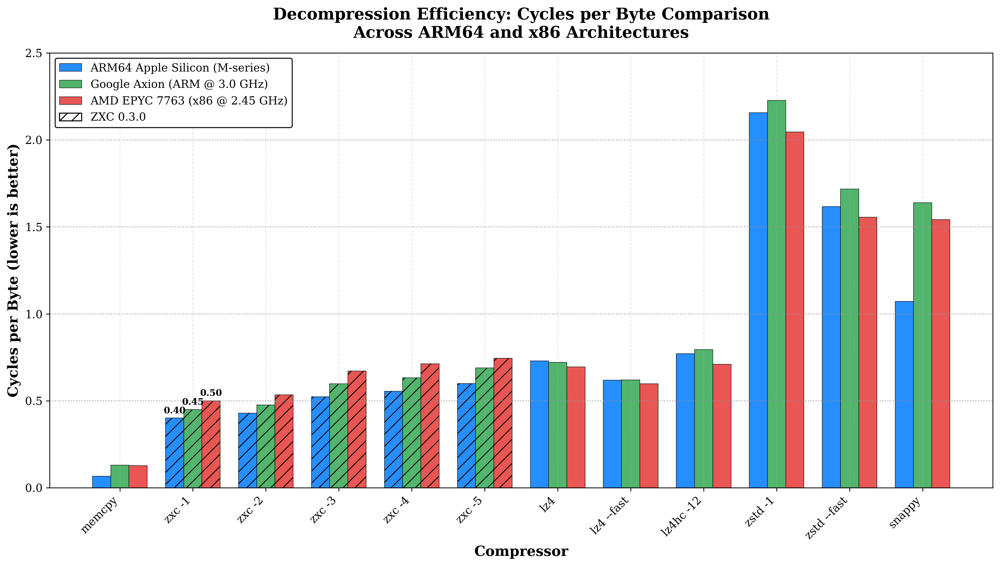

# ZXC: High-Performance Asymmetric Compression for Cross-Platform Deployment

**Subtitle**: Optimizing Storage and Latency in WORM (Write-Once, Read-Many) Architectures
**Version**: 0.3.0
**Date**: December 2025
**Author**: Bertrand Lebonnois

---

## 1. Executive Summary

In modern software delivery pipelines—specifically **Mobile Gaming**, **Embedded Systems**, and **FOTA (Firmware Over-The-Air)**—data is typically generated on high-performance x86 workstations but consumed on energy-constrained ARM devices.

Standard symmetric codecs like LZ4 offer excellent performance but fail to exploit the "Write-Once, Read-Many" (WORM) nature of these pipelines. **ZXC** is a lossless codec designed to bridge this gap. By utilizing an **asymmetric compression model**, ZXC achieves a **40% increase in decompression speed on ARM** compared to LZ4, while simultaneously reducing storage footprints. On x86 development architecture, ZXC maintains competitive throughput, ensuring no disruption to build pipelines.

## 2. The Efficiency Gap

The industry standard, LZ4, prioritizes symmetric speed (fast compression and fast decompression). While ideal for real-time logs or RAM swapping, this symmetry is inefficient for asset distribution.

*   **Wasted Cycles**: CPU cycles saved during the single compression event (on a build server) do not benefit the millions of end-users decoding the data.
*   **The Battery Tax**: On mobile devices, slower decompression keeps the CPU active longer, draining battery and generating heat.

## 3. The ZXC Solution

ZXC utilizes a computationally intensive encoder to generate a bitstream specifically structured to **maximize decompression throughput**. By performing heavy analysis upfront, the encoder produces a layout optimized for the instruction pipelining and branch prediction capabilities of modern CPUs, particularly ARMv8, effectively offloading complexity from the decoder to the encoder.

### 3.1 Asymmetric Pipeline
ZXC employs a Producer-Consumer architecture to decouple I/O operations from CPU-intensive tasks. This allows for parallel processing where input reading, compression/decompression, and output writing occur simultaneously, effectively hiding I/O latency.

### 3.2 Modular Architecture
The ZXC file format is inherently modular. Each block is independent and can be encoded and decoded using the algorithm best suited for that specific data type. This flexibility allows the format to evolve and incorporate new compression strategies without breaking backward compatibility.

## 4. Core Algorithms

ZXC utilizes a hybrid approach combining LZ77 (Lempel-Ziv) dictionary matching with advanced entropy coding and specialized data transforms.

### 4.1 LZ77 Engine
The heart of ZXC is a heavily optimized LZ77 engine that adapts its behavior based on the requested compression level:
*   **Hash Chain & Collision Resolution**: Uses a fast hash table with chaining to find matches in the history window (64KB sliding window).
*   **Lazy Matching**: Implements a "lookahead" strategy to find better matches at the cost of slight encoding speed, significantly improving decompression density.

### 4.2 Specialized SIMD Acceleration & Hardware Hashing
ZXC leverages modern instruction sets to maximize throughput on both ARM and x86 architectures.
* **ARM NEON Optimization**: Extensive usage of vld1q_u8 (vector load) and vceqq_u8 (parallel comparison) allows scanning data at wire speed, while vminvq_u8 provides fast rejection of non-matches.
* **x86 Vectorization**: Maintains high performance on Intel/AMD platforms via dedicated AVX2 and AVX512 paths (falling back to SSE4.1 on older hardware), ensuring parity with ARM throughput.
* **Hardware-Accelerated Indexing**: The encoder's hash table mechanism utilizes hardware CRC32c instructions (__crc32cw on ARM, _mm_crc32_u64 on x86) when available, reducing CPU cycle cost for match finding.
* **High-Speed Integrity**: Block validation relies on XXH3 (64-bit), a modern non-cryptographic hash algorithm that fully exploits vector instructions to verify data integrity without bottlenecking the decompression pipeline.

### 4.3 Entropy Coding & Bitpacking
*   **RLE (Run-Length Encoding)**: Automatically detects runs of identical bytes.
*   **VByte Encoding**: Variable-length integer encoding used for length values >= 15.
*   **Bit-Packing**: Compressed sequences are packed into dedicated streams using minimal bit widths.

## 5. File Format Specification

The ZXC file format is block-based, robust, and designed for parallel processing.

### 5.1 Global Structure
*   **Magic Bytes (4 bytes)**: `0x5A 0x58 0x43 0x30` ("ZXC0").
*   **Version (1 byte)**: Current version is `1`.
*   **Reserved (3 bytes)**: Future use.

### 5.2 Block Header Structure
Each data block consists of a **12-byte** generic header that precedes the specific payload. This header allows the decoder to navigate the stream and identify the processing method required for the next chunk of data.

**Header Format:**

| Offset | Field | Size | Description |
| :--- | :--- | :--- | :--- |
| 0 | `Block Type` | 1 byte | 0=RAW, 1=GNR, 2=NUM |
| 1 | `Flags` | 1 byte | Bit 7 (0x80) = Checksum Present |
| 2 | `Reserved` | 2 bytes | Padding |
| 4 | `Comp Size` | 4 bytes | Compressed payload size |
| 8 | `Raw Size` | 4 bytes | Decompressed size |

* **Type**: 0=RAW, 1=GNR (LZ77), 2=NUM (Integers).
* **Flags**: A bitfield.
Bit 7 (0x80): HAS_CHECKSUM. If this bit is set to 1, an **8-byte XXH3-64** checksum field is present immediately after the Raw Size field, shifting the start of the data payload accordingly.
* **Comp Size**: Size of the data that follows (excluding this 12 or 20-byte header).

> **Note**: While the format is designed for threaded execution, a single-threaded API is also available for constrained environments or simple integration cases.

### 5.3 Specific Header: NUM (Numeric)
(Present immediately after the Block Header and any optional Checksum)

  0               8       10              16
+---------------+-------+---------------+
| Num Values    | Frame | Reserved      |
| (8B)          | (2B)  | (6B)          |
+---------------+-------+---------------+
* **Num Values**: Count of integers encoded.
* **Frame**: Processing window size (currently always 128).

### 5.4 Specific Header: GNR (Generic)
(Present immediately after the Block Header and any optional Checksum)

GNR Header (16 bytes):
+---------------+---------------+-------+-------+-------+-------+
| N Sequences   | N Literals    | Lit   | LitLen| Match | Off   |
| (4B)          | (4B)          | Enc   | Enc   | Enc   | Enc   |
+---------------+---------------+-------+-------+-------+-------+

Followed by 4 "Section Descriptors" (8 bytes each):
+-------------------------------+-------------------------------+
| Compressed Size (4B)          | Raw Size (4B)                 |
+-------------------------------+-------------------------------+

The 4 sections described are, in order:
* **Sequences**: The pairs (Literal Length, Match Length).
* **Literals**: The raw bytes.
* **Tokens**: The pairs (Literal Length, Match Length).
* **Offsets**: The match offset distances.
* **Extras**: The additional lengths (VByte) for very large matches.

### 5.5 Block Encoding & Processing Algorithms

The efficiency of ZXC relies on specialized algorithmic pipelines for each block type.

#### Type 1: GNR (General) - The Workhorse
This format is used for standard data. It employs a **multi-stage encoding pipeline**:

**Encoding Process**:
1.  **LZ77 Parsing**: The encoder iterates through the input using a rolling hash to detect matches.
    *   *Hash Chain*: Collisions are resolved via a chain table to find optimal matches in dense data.
    *   *Lazy Matching*: If a match is found, the encoder checks the next position. If a better match starts there, the current byte is emitted as a literal (deferred matching).
2.  **Tokenization**: Matches are split into three components:
    *   *Literal Length*: Number of raw bytes before the match.
    *   *Match Length*: Duration of the repeated pattern.
    *   *Offset*: Distance back to the pattern start.
3.  **Stream Separation**: These components are routed to separate buffers:
    *   *Literals Buffer*: Raw bytes.
    *   *Tokens Buffer*: Packed `(LitLen << 4) | MatchLen`.
    *   *Offsets Buffer*: 16-bit distances.
    *   *Extras Buffer*: Overflow values for lengths >= 15 (VByte encoded).
4.  **RLE Pass**: The literals buffer is scanned for run-length encoding opportunities (runs of identical bytes). If beneficial (>10% gain), it is compressed in place.
5.  **Final Serialization**: All buffers are concatenated into the payload, preceded by section descriptors.

**Decoding Process**:
1.  **Deserizalization**: The decoder reads the section descriptors to obtain pointers to the start of each stream (Literals, Tokens, Offsets).
2.  **Vertical Execution**: The main loop reads from all three streams simultaneously.
3.  **Wild Copy**:
    *   *Literals*: Copied using unaligned 16-byte SIMD loads/stores (`vld1/vst1` on ARM).
    *   *Matches*: Copied using 16-byte stores. Overlapping matches (e.g., repeating pattern "ABC" for 100 bytes) are handled naturally by the CPU's store forwarding or by specific overlapped-copy primitives.
    *   **Safety**: A "Safe Zone" at the end of the buffer forces a switch to a cautious byte-by-byte loop, allowing the main loop to run without bounds checks.

#### Type 2: NUM (Numeric) - The Specialist
Triggered when data is detected as a dense array of 32-bit integers.

**Encoding Process**:
1.  **Vectorized Delta**: Computes `delta[i] = val[i] - val[i-1]` using SIMD integers (AVX2/NEON).
2.  **ZigZag Transform**: Maps signed deltas to unsigned space: `(d << 1) ^ (d >> 31)`.
3.  **Bit Analysis**: Determines the maximum number of bits `B` needed to represent the deltas in a 128-value frame.
4.  **Bit-Packing**: Packs 128 integers into `128 * B` bits.

**Decoding Process**:
1.  **Bit-Unpacking**: Unpacks bitstreams back into integers.
2.  **ZigZag Decode**: Reverses the mapping.
3.  **Integration**: Computes the prefix sum (cumulative addition) to restore original values. *Note: ZXC utilizes a 4x unrolled loop here to pipeline the dependency chain.*

### 5.6 Data Integrity
Every block can optionally be protected by a **64-bit XXH3** checksum. 
*   **Algorithm**: XXH3 (XXHash3) is an extremely fast, non-cryptographic hash algorithm.
*   **Credit**: Developed by Yann Collet, XXH3 runs at RAM speed equivalents, ensuring that enabling checksums introduces **zero measurable latency** to the pipeline.

## 6. System Architecture (Threading)

ZXC leverages a threaded **Producer-Consumer** model to saturate modern multi-core CPUs.

### 6.1 Asynchronous Compression Pipeline
1.  **Block Splitting (Main Thread)**: The input file is read and sliced into fixed-size chunks (default 256KB).
2.  **Ring Buffer Submission**: Chunks are placed into a lock-free ring buffer.
3.  **Parallel Compression (Worker Threads)**:
    *   Workers pull chunks from the queue.
    *   Each worker compresses its chunk independently in its own context (`zxc_cctx_t`).
    *   Output is written to a thread-local buffer.
4.  **Reordering & Write (Writer Thread)**: The writer thread ensures chunks are written to disk in the correct original order, regardless of which worker finished first.

### 6.2 Asynchronous Decompression Pipeline
1.  **Header Parsing (Main Thread)**: The main thread scans block headers to identify boundaries and payload sizes.
2.  **Dispatch**: Compressed payloads are fed into the worker job queue.
3.  **Parallel Decoding (Worker Threads)**:
    *   Workers decode chunks into pre-allocated output buffers.
    *   **Fast Path**: If the output buffer has sufficient margin, the decoder uses "wild copies" (16-byte SIMD stores) to bypass bounds checking for maximal speed.
4.  **Serialization**: Decompressed blocks are committed to the output stream sequentially.

## 7. Performance Analysis (Benchmarks)

**Methodology:**
Benchmarks were conducted using `lzbench` (by inikep).
* **Target 1 (Client):** Apple M2 / macOS 15 (Clang 17)
* **Target 2 (Cloud):** Google Axion / Linux (GCC 12)
* **Target 3 (Build):** AMD EPYC 7763 / Linux (GCC 13)

**Figure A**: Decompression Throughput & Storage Ratio (Normalized to LZ4)

### 7.1 Client ARM64 Summary (Apple Silicon)

| Compressor | Decompression Speed (Ratio vs LZ4) | Compressed Size (Index LZ4=100) (Lower is Better) |
| :--- | :--- | :--- |
| **zxc 0.3.0 -1** | **1.82x** | **129.87** |
| **zxc 0.3.0 -2** | **1.70x** | **123.78** |
| **zxc 0.3.0 -3** | **1.39x** | **98.43** |
| **zxc 0.3.0 -4** | **1.31x** | **92.60** |
| **zxc 0.3.0 -5** | **1.22x** | **85.94** |
| lz4 1.10.0 --fast -17 | 1.18x | 130.57 |
| lz4 1.10.0 (Ref) | 1.00x | 100.00 |
| lz4hc 1.10.0 -12 | 0.95x | 76.59 |
| snappy 1.2.2 | 0.68x | 100.47 |
| zstd 1.5.7 --fast --1 | 0.45x | 86.17 |
| zstd 1.5.7 -1 | 0.34x | 72.59 |

**Decompression Efficiency (Cycles per Byte @ 3.5 GHz)**

| Compressor.             | Cycles/Byte | Performance vs memcpy |
| ----------------------- | ----------- | --------------------- |
| memcpy                  | 0.067       | 1.00x (baseline)      |
| **zxc 0.3.0 -1**        | **0.401**   | **6.0x**              |
| **zxc 0.3.0 -2**        | **0.429**   | **6.4x**              |
| **zxc 0.3.0 -3**        | **0.523**   | **7.8x**              |
| **zxc 0.3.0 -4**        | **0.555**   | **8.3x**              |
| **zxc 0.3.0 -5**        | **0.599**   | **8.9x**              |
| lz4 1.10.0              | 0.729       | 10.9x                 |
| lz4 1.10.0 --fast -17   | 0.619       | 9.2x                  |
| lz4hc 1.10.0 -12        | 0.771       | 11.5x                 |
| zstd 1.5.7 -1           | 2.156       | 32.2x                 |
| zstd 1.5.7 --fast --1   | 1.617       | 24.1x                 |
| snappy 1.2.2            | 1.072       | 16.0x                 |

*Lower is better. Calculated using Apple M2 Performance Core frequency (3.5 GHz).*

### 7.2 Cloud ARM Summary (Google Axion / Neoverse V2)

| Compressor | Decompression Speed (Ratio vs LZ4) | Compressed Size (Index LZ4=100) (Lower is Better) |
| :--- | :--- | :--- |
| **zxc 0.3.0 -1** | **1.60x** | **129.87** |
| **zxc 0.3.0 -2** | **1.51x** | **123.78** |
| **zxc 0.3.0 -3** | **1.21x** | **98.43** |
| **zxc 0.3.0 -4** | **1.14x** | **92.60** |
| **zxc 0.3.0 -5** | **1.05x** | **85.94** |
| lz4 1.10.0 --fast -17 | 1.16x | 130.57 |
| lz4 1.10.0 (Ref) | 1.00x | 100.00 |
| lz4hc 1.10.0 -12 | 0.91x | 76.59 |
| snappy 1.2.2 | 0.44x | 100.47 |
| zstd 1.5.7 --fast --1 | 0.42x | 86.17 |
| zstd 1.5.7 -1 | 0.32x | 72.59 |

**Decompression Efficiency (Cycles per Byte @ 3.0 GHz)**

| Compressor              | Cycles/Byte | Performance vs memcpy |
| ----------------------- | ----------- | --------------------- |
| memcpy                  | 0.130       | 1.00x (baseline)      |
| **zxc 0.3.0 -1**        | **0.450**   | **3.5x**              |
| **zxc 0.3.0 -2**        | **0.476**   | **3.7x**              |
| **zxc 0.3.0 -3**        | **0.598**   | **4.6x**              |
| **zxc 0.3.0 -4**        | **0.632**   | **4.9x**              |
| **zxc 0.3.0 -5**        | **0.689**   | **5.3x**              |
| lz4 1.10.0              | 0.721       | 5.5x                  |
| lz4 1.10.0 --fast -17   | 0.620       | 4.8x                  |
| lz4hc 1.10.0 -12        | 0.795       | 6.1x                  |
| zstd 1.5.7 -1           | 2.227       | 17.1x                 |
| zstd 1.5.7 --fast --1   | 1.717       | 13.2x                 |
| snappy 1.2.2            | 1.638       | 12.6x                 |

*Lower is better. Calculated using Google Axion (Neoverse V2) frequency (3.0 GHz).*

### 7.3 Build Server Summary (x86_64 / AMD EPYC)

| Compressor | Decompression Speed (Ratio vs LZ4) | Compressed Size (Index LZ4=100) (Lower is Better) |
| :--- | :--- | :--- |
| **zxc 0.3.0 -1** | **1.39x** | **129.87** |
| **zxc 0.3.0 -2** | **1.30x** | **123.78** |
| **zxc 0.3.0 -3** | **1.03x** | **98.43** |
| **zxc 0.3.0 -4** | **0.98x** | **92.60** |
| **zxc 0.3.0 -5** | **0.93x** | **85.94** |
| lz4 1.10.0 --fast -17 | 1.16x | 130.57 |
| lz4 1.10.0 (Ref) | 1.00x | 100.00 |
| lz4hc 1.10.0 -12 | 0.98x | 76.59 |
| snappy 1.2.2 | 0.45x | 100.58 |
| zstd 1.5.7 --fast --1 | 0.45x | 86.17 |
| zstd 1.5.7 -1 | 0.34x | 72.59 |

**Decompression Efficiency (Cycles per Byte @ 2.45 GHz)**

| Compressor.             | Cycles/Byte | Performance vs memcpy |
| ----------------------- | ----------- | --------------------- |
| memcpy                  | 0.128       | 1.00x (baseline)      |
| **zxc 0.3.0 -1**        | **0.500**   | **3.9x**              |
| **zxc 0.3.0 -2**        | **0.535**   | **4.2x**              |
| **zxc 0.3.0 -3**        | **0.672**   | **5.2x**              |
| **zxc 0.3.0 -4**        | **0.713**   | **5.6x**              |
| **zxc 0.3.0 -5**        | **0.745**   | **5.8x**              |
| lz4 1.10.0              | 0.695       | 5.4x                  |
| lz4 1.10.0 --fast -17   | 0.598       | 4.7x                  |
| lz4hc 1.10.0 -12        | 0.710       | 5.5x                  |
| zstd 1.5.7 -1           | 2.045       | 16.0x                 |
| zstd 1.5.7 --fast --1   | 1.556       | 12.2x                 |
| snappy 1.2.2            | 1.542       | 12.0x                 |

*Lower is better. Calculated using AMD EPYC 7763 base frequency (2.45 GHz).*

### 7.4 Benchmarks Results

**Figure B**: Decompression Efficiency : Cycles Per Byte Comparaison

#### 7.4.1 ARM64 Architecture (Apple Silicon)

Benchmarks were conducted using lzbench (from @inikep), compiled with Clang 17.0.0 using *MOREFLAGS="-march=native"* on macOS Sequoia 15.7.2 (Build 24G325). The reference hardware is an Apple M2 processor (ARM64). All performance metrics reflect single-threaded execution on the standard Silesia Corpus.

| Compressor name         | Compression| Decompress.| Compr. size | Ratio | Filename |
| ---------------         | -----------| -----------| ----------- | ----- | -------- |
| memcpy                  | 52773 MB/s | 52216 MB/s |   211938580 |100.00 | 12 files|
| **zxc 0.3.0 -1**            |   721 MB/s |  **8724 MB/s** |   131013961 | **61.82** | 12 files|
| **zxc 0.3.0 -2**            |   479 MB/s |  **8165 MB/s** |   124873774 | **58.92** | 12 files|
| **zxc 0.3.0 -3**            |   211 MB/s |  **6687 MB/s** |    99293477 | **46.85** | 12 files|
| **zxc 0.3.0 -4**            |   190 MB/s |  **6302 MB/s** |    93417296 | **44.08** | 12 files|
| **zxc 0.3.0 -5**            |  79.6 MB/s |  **5844 MB/s** |    86695943 | **40.91** | 12 files|
| lz4 1.10.0              |   816 MB/s |  4801 MB/s |   100880147 | 47.60 | 12 files|
| lz4 1.10.0 --fast -17   |  1342 MB/s |  5650 MB/s |   131723524 | 62.15 | 12 files|
| lz4hc 1.10.0 -12        |  14.1 MB/s |  4541 MB/s |    77262399 | 36.46 | 12 files|
| zstd 1.5.7 -1           |   645 MB/s |  1623 MB/s |    73229468 | 34.55 | 12 files|
| zstd 1.5.7 --fast --1   |   721 MB/s |  2164 MB/s |    86932028 | 41.02 | 12 files|
| snappy 1.2.2            |   883 MB/s |  3264 MB/s |   101352257 | 47.82 | 12 files|

### 7.4.2 ARM64 Architecture (Google Axion)

Benchmarks were conducted using lzbench (from @inikep), compiled with GCC 12.2.0 using *MOREFLAGS="-march=native"* on Linux 64-bits Debian GNU/Linux 12 (bookworm). The reference hardware is a Google Neoverse-V2 processor (ARM64). All performance metrics reflect single-threaded execution on the standard Silesia Corpus.

| Compressor name         | Compression| Decompress.| Compr. size | Ratio | Filename |
| ---------------         | -----------| -----------| ----------- | ----- | -------- |
| memcpy                  | 22939 MB/s | 22987 MB/s |   211938580 |100.00 | 12 files|
| **zxc 0.3.0 -1**            |   677 MB/s |  **6659 MB/s** |   131013961 | **61.82** | 12 files|
| **zxc 0.3.0 -2**            |   425 MB/s |  **6305 MB/s** |   124873774 | **58.92** | 12 files|
| **zxc 0.3.0 -3**            |   200 MB/s |  **5020 MB/s** |    99293477 | **46.85** | 12 files|
| **zxc 0.3.0 -4**            |   173 MB/s |  **4746 MB/s** |    93417296 | **44.08** | 12 files|
| **zxc 0.3.0 -5**            |  71.3 MB/s |  **4353 MB/s** |    86695943 | **40.91** | 12 files|
| lz4 1.10.0              |   740 MB/s |  4163 MB/s |   100880147 | 47.60 | 12 files|
| lz4 1.10.0 --fast -17   |  1279 MB/s |  4837 MB/s |   131723524 | 62.15 | 12 files|
| lz4hc 1.10.0 -12        |  12.5 MB/s |  3775 MB/s |    77262399 | 36.46 | 12 files|
| zstd 1.5.7 -1           |   520 MB/s |  1347 MB/s |    73229468 | 34.55 | 12 files|
| zstd 1.5.7 --fast --1   |   604 MB/s |  1747 MB/s |    86932028 | 41.02 | 12 files|
| snappy 1.2.2            |   751 MB/s |  1831 MB/s |   101352257 | 47.82 | 12 files|

#### 7.4.3 x86_64 Architecture (AMD EPYC)

Benchmarks were conducted using lzbench (from @inikep), compiled with GCC 13.3.0 using *MOREFLAGS="-march=native"* on Linux 64-bits Ubuntu 24.04. The reference hardware is an AMD EPYC 7763 processor (x86_64). All performance metrics reflect single-threaded execution on the standard Silesia Corpus.

| Compressor name         | Compression| Decompress.| Compr. size | Ratio | Filename |
| ---------------         | -----------| -----------| ----------- | ----- | -------- |
| memcpy                  | 19181 MB/s | 19182 MB/s |   211938580 |100.00 | 12 files|
| **zxc 0.3.0 -1**            |   536 MB/s |  **4900 MB/s** |   131013961 | **61.82** | 12 files|
| **zxc 0.3.0 -2**            |   340 MB/s |  **4582 MB/s** |   124873774 | **58.92** | 12 files|
| **zxc 0.3.0 -3**            |   146 MB/s |  **3643 MB/s** |    99293477 | **46.85** | 12 files|
| **zxc 0.3.0 -4**            |   129 MB/s |  **3436 MB/s** |    93417296 | **44.08** | 12 files|
| **zxc 0.3.0 -5**            |  54.4 MB/s |  **3290 MB/s** |    86695943 | **40.91** | 12 files|
| lz4 1.10.0              |   594 MB/s |  3522 MB/s |   100880147 | 47.60 | 12 files|
| lz4 1.10.0 --fast -17   |  1034 MB/s |  4097 MB/s |   131723524 | 62.15 | 12 files|
| lz4hc 1.10.0 -12        |  11.2 MB/s |  3450 MB/s |    77262399 | 36.46 | 12 files|
| zstd 1.5.7 -1           |   410 MB/s |  1198 MB/s |    73229468 | 34.55 | 12 files|
| zstd 1.5.7 --fast --1   |   451 MB/s |  1574 MB/s |    86932028 | 41.02 | 12 files|
| snappy 1.2.2            |   609 MB/s |  1589 MB/s |   101464727 | 47.87 | 12 files|

## 8. Strategic Implementation

ZXC is designed to adapt to various deployment scenarios by selecting the appropriate compression level:

*   **Interactive Media & Gaming (Levels 1-2-3)**:
    Optimized for hard real-time constraints. Ideal for texture streaming and asset loading, offering **~40% faster** load times to minimize latency and frame drops.

*   **Embedded Systems & Firmware (Levels 4-5)**:
    The sweet spot for maximizing storage density on limited flash memory (e.g., Kernel, Initramfs) while ensuring rapid "instant-on" (XIP-like) boot performance.

*   **Data Archival (Levels 4-5)**:
    A high-efficiency alternative for cold storage, providing better compression ratios than LZ4 and significantly faster retrieval speeds than Zstd.

## 9. Conclusion

ZXC redefines asset distribution by prioritizing the end-user experience. Through its asymmetric design and modular architecture, it shifts computational cost to the build pipeline, unlocking unparalleled decompression speeds on ARM devices. This efficiency translates directly into faster load times, reduced battery consumption, and a smoother user experience, making ZXC the definitive choice for modern, high-performance deployment constraints.
