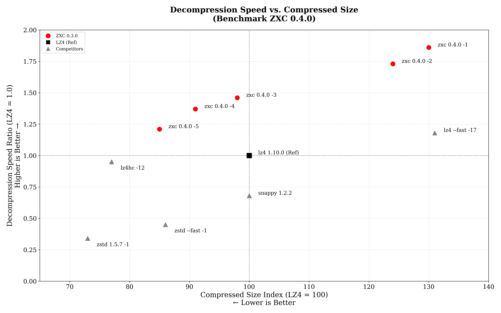
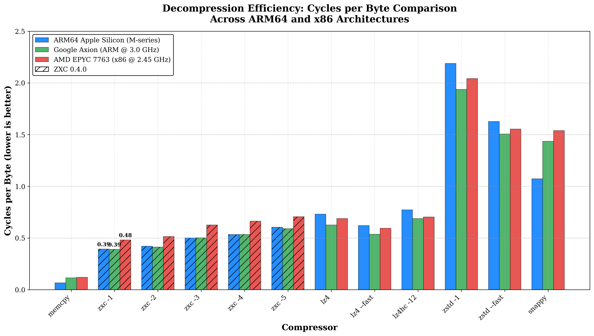

# ZXC: High-Performance Asymmetric Lossless Compression

**Subtitle**: Optimizing Storage and Latency in WORM (Write-Once, Read-Many) Architectures
**Version**: 0.4.0
**Date**: December 2025
**Author**: Bertrand Lebonnois

---

## 1. Executive Summary

In modern software delivery pipelines—specifically **Mobile Gaming**, **Embedded Systems**, and **FOTA (Firmware Over-The-Air)**—data is typically generated on high-performance x86 workstations but consumed on energy-constrained ARM devices.

Standard industry codecs like LZ4 offer excellent performance but fail to exploit the "Write-Once, Read-Many" (WORM) nature of these pipelines. **ZXC** is a lossless codec designed to bridge this gap. By utilizing an **asymmetric compression model**, ZXC achieves a **45% increase in decompression speed on ARM** compared to LZ4, while simultaneously reducing storage footprints. On x86 development architecture, ZXC maintains competitive throughput, ensuring no disruption to build pipelines.

## 2. The Efficiency Gap

The industry standard, LZ4, prioritizes symmetric speed (fast compression and fast decompression). While ideal for real-time logs or RAM swapping, this symmetry is useless for asset distribution.

*   **Wasted Cycles**: CPU cycles saved during the single compression event (on a build server) do not benefit the millions of end-users decoding the data.
*   **The Battery Tax**: On mobile devices, slower decompression keeps the CPU active longer, draining battery and generating heat.

## 3. The ZXC Solution

ZXC utilizes a computationally intensive encoder to generate a bitstream specifically structured to **maximize decompression throughput**. By performing heavy analysis upfront, the encoder produces a layout optimized for the instruction pipelining and branch prediction capabilities of modern CPUs, particularly ARMv8, effectively offloading complexity from the decoder to the encoder.

### 3.1 Asymmetric Pipeline
ZXC employs a Producer-Consumer architecture to decouple I/O operations from CPU-intensive tasks. This allows for parallel processing where input reading, compression/decompression, and output writing occur simultaneously, effectively hiding I/O latency.

### 3.2 Modular Architecture
The ZXC file format is inherently modular. **Each block is independent and can be encoded and decoded using the algorithm best suited** for that specific data type. This flexibility allows the format to evolve and incorporate new compression strategies without breaking backward compatibility.

## 4. Core Algorithms

ZXC utilizes a hybrid approach combining LZ77 (Lempel-Ziv) dictionary matching with advanced entropy coding and specialized data transforms.

### 4.1 LZ77 Engine
The heart of ZXC is a heavily optimized LZ77 engine that adapts its behavior based on the requested compression level:
*   **Hash Chain & Collision Resolution**: Uses a fast hash table with chaining to find matches in the history window (64KB sliding window).
*   **Lazy Matching**: Implements a "lookahead" strategy to find better matches at the cost of slight encoding speed, significantly improving decompression density.

### 4.2 Specialized SIMD Acceleration & Hardware Hashing
ZXC leverages modern instruction sets to maximize throughput on both ARM and x86 architectures.
* **ARM NEON Optimization**: Extensive usage of vld1q_u8 (vector load) and vceqq_u8 (parallel comparison) allows scanning data at wire speed, while vminvq_u8 provides fast rejection of non-matches.
* **x86 Vectorization**: Maintains high performance on Intel/AMD platforms via dedicated AVX2 and AVX512 paths (falling back to SSE4.1 on older hardware), ensuring parity with ARM throughput.
* **Hardware-Accelerated Indexing**: The encoder's hash table mechanism utilizes hardware CRC32c instructions (__crc32cw on ARM, _mm_crc32_u64 on x86) when available, reducing CPU cycle cost for match finding.
* **High-Speed Integrity**: Block validation relies on XXH3 (64-bit), a modern non-cryptographic hash algorithm that fully exploits vector instructions to verify data integrity without bottlenecking the decompression pipeline.

### 4.3 Entropy Coding & Bitpacking
*   **RLE (Run-Length Encoding)**: Automatically detects runs of identical bytes.
*   **VByte Encoding**: Variable-length integer encoding (similar to LEB128) for overflow values.
*   **Bit-Packing**: Compressed sequences are packed into dedicated streams using minimal bit widths.

#### VByte Format

VByte (Variable Byte) encoding stores integers using 7 bits per byte, with the MSB as a continuation flag:

```
Single byte (values 0-127):
+---+---+---+---+---+---+---+---+
| 0 |  7-bit value (0-127)      |
+---+---+---+---+---+---+---+---+
  ^
  └── MSB = 0: Last byte

Multi-byte (values >= 128):
+---+---+---+---+---+---+---+---+   +---+---+---+---+---+---+---+---+
| 1 |   7 bits (low)            |   | 0 |   7 bits (high)           |
+---+---+---+---+---+---+---+---+   +---+---+---+---+---+---+---+---+
  ^                                   ^
  └── MSB = 1: More bytes             └── MSB = 0: Last byte
```

**Byte count by value range:**

| Value Range       | Bytes | Max Bits |
|-------------------|-------|----------|
| 0 - 127           | 1     | 7        |
| 128 - 16,383      | 2     | 14       |
| 16,384 - 2,097,151| 3     | 21       |
| ≥ 2,097,152       | 5     | 35       |

**Example**: Encoding value `300` (binary: `100101100`):
```
300 = 0b100101100 → Split into 7-bit groups: [0101100] [0000010]
Byte 1: 1|0101100 = 0xAC  (MSB=1: more bytes, low 7 bits = 44)
Byte 2: 0|0000010 = 0x02  (MSB=0: last byte, high 7 bits = 2)
Decode: 44 + (2 << 7) = 44 + 256 = 300 ✓
```

## 5. File Format Specification

The ZXC file format is block-based, robust, and designed for parallel processing.

### 5.1 Global Structure (File Header)

The file begins with an **8-byte** header that identifies the format and specifies decompression parameters.

**FILE Header (8 bytes):**

```
  Offset:  0               4       5       6               8
           +---------------+-------+-------+---------------+
           | Magic Word    | Ver   | Chunk | Reserved      |
           | (4 bytes)     | (1B)  | (1B)  | (2 bytes)     |
           +---------------+-------+-------+---------------+
```

* **Magic Word (4 bytes)**: `0x5A 0x58 0x43 0x30` ("ZXC0" in Little Endian).
* **Version (1 byte)**: Current version is `1`.
* **Chunk Size Code (1 byte)**: Defines the processing block size:
  - `0` = Default mode (256 KB, for backward compatibility)
  - `N` = Chunk size is `N × 4096` bytes (e.g., `62` = 248 KB)
* **Reserved (2 bytes)**: Future use.

### 5.2 Block Header Structure
Each data block consists of a **12-byte** generic header that precedes the specific payload. This header allows the decoder to navigate the stream and identify the processing method required for the next chunk of data.

**BLOCK Header (12 bytes):**

```
  Offset:  0       1       2               4                       8                       12
          +-------+-------+---------------+-----------------------+-----------------------+
          | Type  | Flags | Reserved      | Comp Size             | Raw Size              |
          | (1B)  | (1B)  | (2 bytes)     | (4 bytes)             | (4 bytes)             |
          +-------+-------+---------------+-----------------------+-----------------------+

  If HAS_CHECKSUM flag is set (Flags & 0x80):
  Offset:  12                                                                              20
          +-----------------------------------------------------------------------------+
          | Checksum (XXH3-64)                                                          |
          | (8 bytes)                                                                   |
          +-----------------------------------------------------------------------------+
```

* **Type**: Block encoding type (0=RAW, 1=GNR, 2=NUM).
* **Flags**: Bit 7 (0x80) = HAS_CHECKSUM. If set, an **8-byte XXH3-64** checksum follows immediately after Raw Size.
* **Comp Size**: Compressed payload size (excluding header and optional checksum).
* **Raw Size**: Original decompressed size.

> **Note**: While the format is designed for threaded execution, a single-threaded API is also available for constrained environments or simple integration cases.

### 5.3 Specific Header: NUM (Numeric)
(Present immediately after the Block Header and any optional Checksum)

**NUM Header (16 bytes):**

```
  Offset:  0                               8       10                      16
          +-------------------------------+-------+-------------------------+
          | N Values                      | Frame | Reserved                |
          | (8 bytes)                     | (2B)  | (6 bytes)               |
          +-------------------------------+-------+-------------------------+
```

* **N Values**: Total count of integers encoded in the block.
* **Frame**: Processing window size (currently always 128).
* **Reserved**: Padding for alignment.

### 5.4 Specific Header: GNR (Generic)
(Present immediately after the Block Header and any optional Checksum)

**GNR Header (16 bytes):**

```
  Offset:  0               4               8   9  10  11  12              16
          +---------------+---------------+---+---+---+---+---------------+
          | N Sequences   | N Literals    |Lit|LL |ML |Off| Reserved      |
          | (4 bytes)     | (4 bytes)     |Enc|Enc|Enc|Enc| (4 bytes)     |
          +---------------+---------------+---+---+---+---+---------------+
```

* **N Sequences**: Total count of LZ sequences in the block.
* **N Literals**: Total count of literal bytes.
* **Encoding Types**
  - `Lit Enc`: Literal stream encoding (0=RAW, 1=RLE). **Currently used.**
  - `LL Enc`: Literal lengths encoding. **Reserved for future use** (lengths are packed in tokens).
  - `ML Enc`: Match lengths encoding. **Reserved for future use** (lengths are packed in tokens).
  - `Off Enc`: Offset encoding mode. **Currently used (v0.4.0):**
    - `0` = 16-bit offsets (2 bytes each, max distance 65535)
    - `1` = 8-bit offsets (1 byte each, max distance 255)
* **Reserved**: Padding for alignment.

**Section Descriptors (4 × 8 bytes = 32 bytes total):**

Each descriptor stores sizes as a packed 64-bit value:

```
  Single Descriptor (8 bytes):
  +-----------------------------------+-----------------------------------+
  | Compressed Size (4 bytes)         | Raw Size (4 bytes)                |
  | (low 32 bits)                     | (high 32 bits)                    |
  +-----------------------------------+-----------------------------------+

  Full Layout (32 bytes):
  Offset:  0               8               16              24              32
          +---------------+---------------+---------------+---------------+
          | Literals Desc | Tokens Desc   | Offsets Desc  | Extras Desc   |
          | (8 bytes)     | (8 bytes)     | (8 bytes)     | (8 bytes)     |
          +---------------+---------------+---------------+---------------+
```

**Section Contents:**

| # | Section     | Description                                           |
|---|-------------|-------------------------------------------------------|
| 0 | **Literals**| Raw bytes to copy, or RLE-compressed if `enc_lit=1`  |
| 1 | **Tokens**  | Packed bytes: `(LiteralLen << 4) \| MatchLen`        |
| 2 | **Offsets** | Match distances: 8-bit if `enc_off=1`, else 16-bit LE |
| 3 | **Extras**  | VByte overflow values when LitLen or MatchLen ≥ 15   |

**Data Flow Example:**

```
GNR Block Data Layout:
+------------------------------------------------------------------------+
| Literals Stream | Tokens Stream | Offsets Stream | Extras Stream      |
| (desc[0] bytes) | (desc[1] bytes)| (desc[2] bytes)| (desc[3] bytes)   |
+------------------------------------------------------------------------+
       ↓                 ↓                 ↓                 ↓
   Raw bytes      Token parsing      Match lookup      Length overflow
```

**Why Comp Size and Raw Size?**

Each descriptor stores both a compressed and raw size to support secondary encoding of streams:

| Section     | Comp Size            | Raw Size            | Different?           |
|-------------|----------------------|---------------------|----------------------|
| **Literals**| RLE size (if used)   | Original byte count | Yes, if RLE enabled |
| **Tokens**  | Stream size          | Stream size         | No                   |
| **Offsets** | N×1 or N×2 bytes     | N×1 or N×2 bytes    | No (size depends on `enc_off`) |
| **Extras**  | VByte stream size    | VByte stream size   | No                   |

Currently, the **Literals** section uses different sizes when RLE compression is applied (`enc_lit=1`). The **Offsets** section size depends on `enc_off`: N sequences × 1 byte (if `enc_off=1`) or N sequences × 2 bytes (if `enc_off=0`).

> **Design Note**: This format is designed for future extensibility. The dual-size architecture allows adding entropy coding (FSE/ANS) or bitpacking to any stream without breaking backward compatibility.


### 5.5 Block Encoding & Processing Algorithms

The efficiency of ZXC relies on specialized algorithmic pipelines for each block type.

#### Type 1: GNR (General) - The Workhorse
This format is used for standard data. It employs a **multi-stage encoding pipeline**:

**Encoding Process**:
1.  **LZ77 Parsing**: The encoder iterates through the input using a rolling hash to detect matches.
    *   *Hash Chain*: Collisions are resolved via a chain table to find optimal matches in dense data.
    *   *Lazy Matching*: If a match is found, the encoder checks the next position. If a better match starts there, the current byte is emitted as a literal (deferred matching).
2.  **Tokenization**: Matches are split into three components:
    *   *Literal Length*: Number of raw bytes before the match.
    *   *Match Length*: Duration of the repeated pattern.
    *   *Offset*: Distance back to the pattern start.
3.  **Stream Separation**: These components are routed to separate buffers:
    *   *Literals Buffer*: Raw bytes.
    *   *Tokens Buffer*: Packed `(LitLen << 4) | MatchLen`.
    *   *Offsets Buffer*: Variable-width distances (8-bit or 16-bit, see below).
    *   *Extras Buffer*: Overflow values for lengths >= 15 (VByte encoded).
    *   *Offset Mode Selection (v0.4.0)*: The encoder tracks the maximum offset across all sequences. If all offsets are ≤ 255, the 8-bit mode (`enc_off=1`) is selected, saving 1 byte per sequence compared to 16-bit mode.
4.  **RLE Pass**: The literals buffer is scanned for run-length encoding opportunities (runs of identical bytes). If beneficial (>10% gain), it is compressed in place.
5.  **Final Serialization**: All buffers are concatenated into the payload, preceded by section descriptors.

**Decoding Process**:
1.  **Deserizalization**: The decoder reads the section descriptors to obtain pointers to the start of each stream (Literals, Tokens, Offsets).
2.  **Vertical Execution**: The main loop reads from all three streams simultaneously.
3.  **Wild Copy**:
    *   *Literals*: Copied using unaligned 16-byte SIMD loads/stores (`vld1/vst1` on ARM).
    *   *Matches*: Copied using 16-byte stores. Overlapping matches (e.g., repeating pattern "ABC" for 100 bytes) are handled naturally by the CPU's store forwarding or by specific overlapped-copy primitives.
    *   **Safety**: A "Safe Zone" at the end of the buffer forces a switch to a cautious byte-by-byte loop, allowing the main loop to run without bounds checks.

#### Type 2: NUM (Numeric) - The Specialist
Triggered when data is detected as a dense array of 32-bit integers.

**Encoding Process**:
1.  **Vectorized Delta**: Computes `delta[i] = val[i] - val[i-1]` using SIMD integers (AVX2/NEON).
2.  **ZigZag Transform**: Maps signed deltas to unsigned space: `(d << 1) ^ (d >> 31)`.
3.  **Bit Analysis**: Determines the maximum number of bits `B` needed to represent the deltas in a 128-value frame.
4.  **Bit-Packing**: Packs 128 integers into `128 * B` bits.

**Decoding Process**:
1.  **Bit-Unpacking**: Unpacks bitstreams back into integers.
2.  **ZigZag Decode**: Reverses the mapping.
3.  **Integration**: Computes the prefix sum (cumulative addition) to restore original values. *Note: ZXC utilizes a 4x unrolled loop here to pipeline the dependency chain.*

### 5.6 Data Integrity
Every block can optionally be protected by a **64-bit XXH3** checksum. 
*   **Algorithm**: XXH3 (XXHash3) is an extremely fast, non-cryptographic hash algorithm.
*   **Credit**: Developed by Yann Collet, XXH3 runs at RAM speed equivalents, ensuring that enabling checksums introduces **zero measurable latency** to the pipeline.

## 6. System Architecture (Threading)

ZXC leverages a threaded **Producer-Consumer** model to saturate modern multi-core CPUs.

### 6.1 Asynchronous Compression Pipeline
1.  **Block Splitting (Main Thread)**: The input file is read and sliced into fixed-size chunks (default 248KB).
2.  **Ring Buffer Submission**: Chunks are placed into a lock-free ring buffer.
3.  **Parallel Compression (Worker Threads)**:
    *   Workers pull chunks from the queue.
    *   Each worker compresses its chunk independently in its own context (`zxc_cctx_t`).
    *   Output is written to a thread-local buffer.
4.  **Reordering & Write (Writer Thread)**: The writer thread ensures chunks are written to disk in the correct original order, regardless of which worker finished first.

### 6.2 Asynchronous Decompression Pipeline
1.  **Header Parsing (Main Thread)**: The main thread scans block headers to identify boundaries and payload sizes.
2.  **Dispatch**: Compressed payloads are fed into the worker job queue.
3.  **Parallel Decoding (Worker Threads)**:
    *   Workers decode chunks into pre-allocated output buffers.
    *   **Fast Path**: If the output buffer has sufficient margin, the decoder uses "wild copies" (16-byte SIMD stores) to bypass bounds checking for maximal speed.
4.  **Serialization**: Decompressed blocks are committed to the output stream sequentially.

## 7. Performance Analysis (Benchmarks)

**Methodology:**
Benchmarks were conducted using `lzbench` (by inikep).
* **Target 1 (Client):** Apple M2 / macOS 15 (Clang 17)
* **Target 2 (Cloud):** Google Axion / Linux (GCC 12)
* **Target 3 (Build):** AMD EPYC 7763 / Linux (GCC 13)

**Figure A**: Decompression Throughput & Storage Ratio (Normalized to LZ4)




### 7.1 Client ARM64 Summary (Apple Silicon)

| Compressor | Decompression Speed (Ratio vs LZ4) | Compressed Size (Index LZ4=100) (Lower is Better) |
| :--- | :--- | :--- |
| **zxc 0.4.0 -1** | **1.85x** | **129.88** |
| **zxc 0.4.0 -2** | **1.72x** | **123.79** |
| **zxc 0.4.0 -3** | **1.44x** | **98.31** |
| **zxc 0.4.0 -4** | **1.36x** | **91.25** |
| **zxc 0.4.0 -5** | **1.25x** | **85.44** |
| lz4 1.10.0 --fast -17 | 1.18x | 130.59 |
| lz4 1.10.0 (Ref) | 1.00x | 100.00 |
| lz4hc 1.10.0 -12 | 0.95x | 76.59 |
| snappy 1.2.2 | 0.68x | 100.47 |
| zstd 1.5.7 --fast --1 | 0.45x | 86.17 |
| zstd 1.5.7 -1 | 0.34x | 72.60 |

**Decompression Efficiency (Cycles per Byte @ 3.5 GHz)**

| Compressor.             | Cycles/Byte | Performance vs memcpy (*) |
| ----------------------- | ----------- | --------------------- |
| memcpy                  | 0.066       | 1.00x (baseline)      |
| **zxc 0.4.0 -1**        | **0.395**   | **6.0x**              |
| **zxc 0.4.0 -2**        | **0.423**   | **6.4x**              |
| **zxc 0.4.0 -3**        | **0.505**   | **7.6x**              |
| **zxc 0.4.0 -4**        | **0.538**   | **8.1x**              |
| **zxc 0.4.0 -5**        | **0.585**   | **8.8x**              |
| lz4 1.10.0              | 0.729       | 11.0x                 |
| lz4 1.10.0 --fast -17   | 0.620       | 9.4x                  |
| lz4hc 1.10.0 -12        | 0.770       | 11.6x                 |
| zstd 1.5.7 -1           | 2.157       | 32.6x                 |
| zstd 1.5.7 --fast --1   | 1.619       | 24.5x                 |
| snappy 1.2.2            | 1.072       | 16.2x                 |

*Lower is better. Calculated using Apple M2 Performance Core frequency (3.5 GHz).*


### 7.2 Cloud Server Summary (ARM / Google Axion)

| Compressor | Decompression Speed (Ratio vs LZ4) | Compressed Size (Index LZ4=100) (Lower is Better) |
| :--- | :--- | :--- |
| **zxc 0.4.0 -1** | **1.61x** | **129.88** |
| **zxc 0.4.0 -2** | **1.52x** | **123.79** |
| **zxc 0.4.0 -3** | **1.25x** | **98.31** |
| **zxc 0.4.0 -4** | **1.17x** | **91.25** |
| **zxc 0.4.0 -5** | **1.06x** | **85.44** |
| lz4 1.10.0 --fast -17 | 1.17x | 130.59 |
| lz4 1.10.0 (Ref) | 1.00x | 100.00 |
| lz4hc 1.10.0 -12 | 0.91x | 76.59 |
| snappy 1.2.2 | 0.44x | 100.47 |
| zstd 1.5.7 --fast --1 | 0.42x | 86.17 |
| zstd 1.5.7 -1 | 0.32x | 72.60 |

**Decompression Efficiency (Cycles per Byte @ 2.6 GHz)**

| Compressor.             | Cycles/Byte | Performance vs memcpy (*) |
| ----------------------- | ----------- | --------------------- |
| memcpy                  | 0.109       | 1.00x (baseline)      |
| **zxc 0.4.0 -1**        | **0.387**   | **3.6x**              |
| **zxc 0.4.0 -2**        | **0.409**   | **3.8x**              |
| **zxc 0.4.0 -3**        | **0.498**   | **4.6x**              |
| **zxc 0.4.0 -4**        | **0.532**   | **4.9x**              |
| **zxc 0.4.0 -5**        | **0.587**   | **5.4x**              |
| lz4 1.10.0              | 0.622       | 5.7x                  |
| lz4 1.10.0 --fast -17   | 0.534       | 4.9x                  |
| lz4hc 1.10.0 -12        | 0.684       | 6.3x                  |
| zstd 1.5.7 -1           | 1.926       | 17.7x                 |
| zstd 1.5.7 --fast --1   | 1.493       | 13.7x                 |
| snappy 1.2.2            | 1.415       | 13.0x                 |

*Lower is better. Calculated using Neoverse-V2 base frequency (2.6 GHz).*


### 7.3 Build Server Summary (x86_64 / AMD EPYC)

| Compressor | Decompression Speed (Ratio vs LZ4) | Compressed Size (Index LZ4=100) (Lower is Better) |
| :--- | :--- | :--- |
| **zxc 0.4.0 -1** | **1.43x** | **129.88** |
| **zxc 0.4.0 -2** | **1.34x** | **123.79** |
| **zxc 0.4.0 -3** | **1.11x** | **98.31** |
| **zxc 0.4.0 -4** | **1.05x** | **91.25** |
| **zxc 0.4.0 -5** | **0.99x** | **85.44** |
| lz4 1.10.0 --fast -17 | 1.16x | 130.59 |
| lz4 1.10.0 (Ref) | 1.00x | 100.00 |
| lz4hc 1.10.0 -12 | 0.98x | 76.59 |
| snappy 1.2.2 | 0.45x | 100.58 |
| zstd 1.5.7 --fast --1 | 0.44x | 86.17 |
| zstd 1.5.7 -1 | 0.34x | 72.60 |

**Decompression Efficiency (Cycles per Byte @ 2.45 GHz)**

| Compressor.             | Cycles/Byte | Performance vs memcpy (*) |
| ----------------------- | ----------- | --------------------- |
| memcpy                  | 0.120       | 1.00x (baseline)      |
| **zxc 0.4.0 -1**        | **0.484**   | **4.0x**              |
| **zxc 0.4.0 -2**        | **0.516**   | **4.3x**              |
| **zxc 0.4.0 -3**        | **0.621**   | **5.2x**              |
| **zxc 0.4.0 -4**        | **0.657**   | **5.5x**              |
| **zxc 0.4.0 -5**        | **0.698**   | **5.8x**              |
| lz4 1.10.0              | 0.690       | 5.8x                  |
| lz4 1.10.0 --fast -17   | 0.597       | 5.0x                  |
| lz4hc 1.10.0 -12        | 0.705       | 5.9x                  |
| zstd 1.5.7 -1           | 2.048       | 17.1x                 |
| zstd 1.5.7 --fast --1   | 1.560       | 13.0x                 |
| snappy 1.2.2            | 1.541       | 12.8x                 |

*Lower is better. Calculated using AMD EPYC 7763 base frequency (2.45 GHz).*


### 7.4 Benchmarks Results

**Figure B**: Decompression Efficiency : Cycles Per Byte Comparaison




#### 7.4.1 ARM64 Architecture (Apple Silicon)

Benchmarks were conducted using lzbench 2.2.1 (from @inikep), compiled with Clang 17.0.0 using *MOREFLAGS="-march=native"* on macOS Sequoia 15.7.2 (Build 24G325). The reference hardware is an Apple M2 processor (ARM64).

**All performance metrics reflect single-threaded execution on the standard Silesia Corpus.**

| Compressor name         | Compression| Decompress.| Compr. size | Ratio | Filename |
| ---------------         | -----------| -----------| ----------- | ----- | -------- |
| memcpy                  | 52889 MB/s | 52862 MB/s |   211938580 |100.00 | 12 files|
| **zxc 0.4.0 -1**        |   753 MB/s |  **8873 MB/s** |   131006241 | **61.81** | 12 files|
| **zxc 0.4.0 -2**        |   611 MB/s |  **8278 MB/s** |   124876023 | **58.92** | 12 files|
| **zxc 0.4.0 -3**        |   153 MB/s |  **6930 MB/s** |    99179268 | **46.80** | 12 files|
| **zxc 0.4.0 -4**        |   101 MB/s |  **6510 MB/s** |    92051238 | **43.43** | 12 files|
| **zxc 0.4.0 -5**        |  59.6 MB/s |  **5982 MB/s** |    86187901 | **40.67** | 12 files|
| lz4 1.10.0              |   816 MB/s |  4802 MB/s |   100880147 | 47.60 | 12 files|
| lz4 1.10.0 --fast -17   |  1343 MB/s |  5648 MB/s |   131723524 | 62.15 | 12 files|
| lz4hc 1.10.0 -12        |  13.9 MB/s |  4545 MB/s |    77262399 | 36.46 | 12 files|
| zstd 1.5.7 -1           |   645 MB/s |  1623 MB/s |    73229468 | 34.55 | 12 files|
| zstd 1.5.7 --fast --1   |   725 MB/s |  2162 MB/s |    86932028 | 41.02 | 12 files|
| snappy 1.2.2            |   884 MB/s |  3264 MB/s |   101352257 | 47.82 | 12 files|


### 7.4.2 ARM64 Architecture (Google Axion)

Benchmarks were conducted using lzbench 2.2.1 (from @inikep), compiled with GCC 12.2.0 using *MOREFLAGS="-march=native"* on Linux 64-bits Debian GNU/Linux 12 (bookworm). The reference hardware is a Google Neoverse-V2 processor (ARM64).

**All performance metrics reflect single-threaded execution on the standard Silesia Corpus.**

| Compressor name         | Compression| Decompress.| Compr. size | Ratio | Filename |
| ---------------         | -----------| -----------| ----------- | ----- | -------- |
| memcpy                  | 23374 MB/s | 23861 MB/s |   211938580 |100.00 | 12 files|
| **zxc 0.4.0 -1**            |   688 MB/s |  **6712 MB/s** |   131006241 | **61.81** | 12 files|
| **zxc 0.4.0 -2**            |   561 MB/s |  **6351 MB/s** |   124876023 | **58.92** | 12 files|
| **zxc 0.4.0 -3**            |   145 MB/s |  **5224 MB/s** |    99179268 | **46.80** | 12 files|
| **zxc 0.4.0 -4**            |  97.2 MB/s |  **4889 MB/s** |    92051238 | **43.43** | 12 files|
| **zxc 0.4.0 -5**            |  50.0 MB/s |  **4429 MB/s** |    86187901 | **40.67** | 12 files|
| lz4 1.10.0              |   740 MB/s |  4178 MB/s |   100880147 | 47.60 | 12 files|
| lz4 1.10.0 --fast -17   |  1277 MB/s |  4870 MB/s |   131723524 | 62.15 | 12 files|
| lz4hc 1.10.0 -12        |  12.4 MB/s |  3800 MB/s |    77262399 | 36.46 | 12 files|
| zstd 1.5.7 -1           |   520 MB/s |  1350 MB/s |    73229468 | 34.55 | 12 files|
| zstd 1.5.7 --fast --1   |   604 MB/s |  1742 MB/s |    86932028 | 41.02 | 12 files|
| snappy 1.2.2            |   749 MB/s |  1838 MB/s |   101352257 | 47.82 | 12 files|


#### 7.4.3 x86_64 Architecture (AMD EPYC)

Benchmarks were conducted using lzbench 2.2.1 (from @inikep), compiled with GCC 13.3.0 using *MOREFLAGS="-march=native"* on Linux 64-bits Ubuntu 24.04. The reference hardware is an AMD EPYC 7763 processor (x86_64).

**All performance metrics reflect single-threaded execution on the standard Silesia Corpus.**

| Compressor name         | Compression| Decompress.| Compr. size | Ratio | Filename |
| ---------------         | -----------| -----------| ----------- | ----- | -------- |
| memcpy                  | 19613 MB/s | 19399 MB/s |   211938580 |100.00 | 12 files|
| **zxc 0.4.0 -1**            |   542 MB/s |  **5060 MB/s** |   131006241 | **61.81** | 12 files|
| **zxc 0.4.0 -2**            |   445 MB/s |  **4750 MB/s** |   124876023 | **58.92** | 12 files|
| **zxc 0.4.0 -3**            |   111 MB/s |  **3943 MB/s** |    99179268 | **46.80** | 12 files|
| **zxc 0.4.0 -4**            |  74.6 MB/s |  **3730 MB/s** |    92051238 | **43.43** | 12 files|
| **zxc 0.4.0 -5**            |  42.2 MB/s |  **3507 MB/s** |    86187901 | **40.67** | 12 files|
| lz4 1.10.0              |   593 MB/s |  3549 MB/s |   100880147 | 47.60 | 12 files|
| lz4 1.10.0 --fast -17   |  1034 MB/s |  4105 MB/s |   131723524 | 62.15 | 12 files|
| lz4hc 1.10.0 -12        |  11.2 MB/s |  3476 MB/s |    77262399 | 36.46 | 12 files|
| zstd 1.5.7 -1           |   410 MB/s |  1196 MB/s |    73229468 | 34.55 | 12 files|
| zstd 1.5.7 --fast --1   |   448 MB/s |  1571 MB/s |    86932028 | 41.02 | 12 files|
| snappy 1.2.2            |   609 MB/s |  1590 MB/s |   101464727 | 47.87 | 12 files|


## 8. Strategic Implementation

ZXC is designed to adapt to various deployment scenarios by selecting the appropriate compression level:

*   **Interactive Media & Gaming (Levels 1-2-3)**:
    Optimized for hard real-time constraints. Ideal for texture streaming and asset loading, offering **~40% faster** load times to minimize latency and frame drops.

*   **Embedded Systems & Firmware (Levels 4-5)**:
    The sweet spot for maximizing storage density on limited flash memory (e.g., Kernel, Initramfs) while ensuring rapid "instant-on" (XIP-like) boot performance.

*   **Data Archival (Levels 4-5)**:
    A high-efficiency alternative for cold storage, providing better compression ratios than LZ4 and significantly faster retrieval speeds than Zstd.

## 9. Conclusion

ZXC redefines asset distribution by prioritizing the end-user experience. Through its asymmetric design and modular architecture, it shifts computational cost to the build pipeline, unlocking unparalleled decompression speeds on ARM devices. This efficiency translates directly into faster load times, reduced battery consumption, and a smoother user experience, making ZXC a best choice for modern, high-performance deployment constraints.
